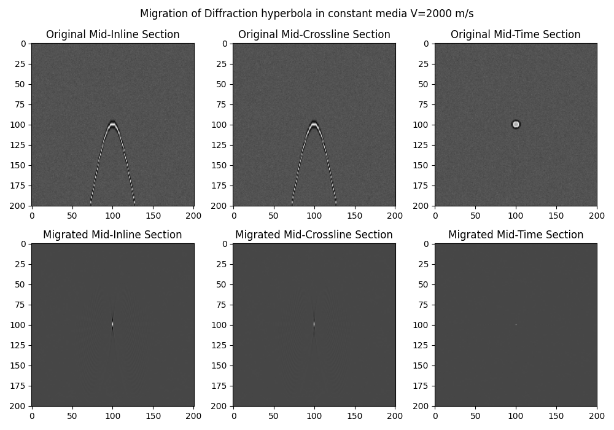

# poststackmig3D

Command line utility for Kirchhoff Poststack 3D migration (C++ implementation). Performs diffraction summation on zero-offset (post-stack) seismic data in SEG-Y with amplitude correction with given Vrms velocity model (or just constant velocity). 

## Features

- **Memory optimization**: loads only traces needed for current aperture calculation into buffer
- **High performance**: uses SIMD vectorization (AVX2) and OpenMP parallelization for accelerated computations
- **Flexible velocity handling**: support for SEG-Y files and constant values
- **Padding support**: adding zero traces at data edges
- **Unsorted file support**: automatic lookup table creation
- **Progress tracking**: real-time progress bar with ETA and processing rate

## Building

### Requirements

- CMake >= 3.10
- C++11 compatible compiler (GCC, Clang, or MSVC)
- OpenMP (optional, for parallelization)
- x86_64 processor (for SIMD optimizations)

### Build Instructions

```bash
mkdir build
cd build
cmake ..
make
```

Or with specific options:

```bash
cmake -DENABLE_OPENMP=ON -DENABLE_SIMD=ON ..
make
```

### Build Options

- `ENABLE_OPENMP` (default: ON) - Enable OpenMP parallelization
- `ENABLE_SIMD` (default: ON) - Enable SIMD optimizations (AVX2/FMA)

The number of OpenMP threads can be controlled via the `n_threads` parameter in the configuration file (default: 0 = use all available threads) or via the `OMP_NUM_THREADS` environment variable.

### Installation

```bash
make install
```

This installs the `poststackmig` executable to the system `bin` directory (default: `/usr/local/bin`).

## Usage

```bash
./poststackmig config.txt
```

Or if installed:

```bash
poststackmig config.txt
```

## Configuration File Format

Create a configuration file in `key=value` format. Example:

```
input_data=data/stack.sgy
output_data=data/stack_mig.sgy
inline_step=25.0
crossline_step=25.0
inline_padding=30
crossline_padding=30
velocity=data/vel.sgy
angle_aperture=30.0
amp_correction=true
n_threads=4
```

See `config_example.txt` for a complete example.

### Example Data

The repository includes example data (`data/diffractor3d.sgy`) and configuration file (`config_example.txt`) for testing. The example data contains a synthetic diffraction hyperbola with apex in the center of a cube, derived in homogeneous media of V=2000 m/s, with random noise added.



### Parameters

- **input_data** (required) - path to input SEG-Y file
- **output_data** (required) - path to output SEG-Y file
- **inline_step** (required) - inline step in meters
- **crossline_step** (required) - crossline step in meters
- **inline_padding** (default: 0) - number of zero traces on each side along inlines
- **crossline_padding** (default: 0) - number of zero traces on each side along crosslines
- **velocity** (required) - migration velocity:
  - SEG-Y file: `velocity=data/vel.sgy`
  - Text table file: `velocity=data/vel_table.txt` (format: INLINE CROSSLINE TIME VEL)
  - Constant: `velocity=2500.0`
- **angle_aperture** (default: 30.0) - angular aperture in degrees
- **amp_correction** (default: true) - enable amplitude correction for divergence 1/(t*v²)
- **n_threads** (default: 0) - number of OpenMP threads to use (0 = use all available threads)

## Input Data Requirements

Input SEG-Y file must contain headers:
- `INLINE_3D` - inline number (offset 188)
- `CROSSLINE_3D` - crossline number (offset 192)

The file can be unsorted - the program will automatically create a lookup table.

Supported data formats:
- Format 1: IBM Float
- Format 5: IEEE Float

## Project Structure

```
poststackmig3d/
├── src/
│   ├── main.cpp              # Main entry point
│   ├── config_parser.cpp     # Configuration parsing
│   ├── segy_utils.cpp        # SEG-Y file handling
│   ├── velocity_reader.cpp   # Velocity reading
│   ├── migration_kernel.cpp  # Migration kernel (SIMD optimized)
│   └── progress_bar.cpp      # Progress bar implementation
├── include/
│   ├── config_parser.h
│   ├── segy_utils.h
│   ├── velocity_reader.h
│   ├── migration_kernel.h
│   └── progress_bar.h
├── CMakeLists.txt            # Build configuration
├── config_example.txt        # Configuration example
└── README.md                  # This file
```

## Performance Features

- **OpenMP parallelization**: parallel processing over crosslines
- **SIMD optimizations**: AVX2/FMA instructions for vectorized operations
- **Optimized I/O**: batch reading/writing of traces
- **Memory-efficient buffering**: loads only required traces for aperture calculation

## Dependencies

The program uses only standard C++ libraries and does not require external dependencies:
- Standard C++11 library
- OpenMP (optional, for parallelization)
- SIMD intrinsics (compiler-provided)

## Notes

- The program uses a progress bar to display execution progress with ETA and processing rate
- When working with large files, it's recommended to monitor memory usage
- Output file is created with extended dimensions (accounting for padding)
- For best performance, compile with optimization flags (`-O3`) and enable SIMD/OpenMP
- The number of OpenMP threads can be controlled via `n_threads` parameter in the configuration file (default: 0 = use all available threads) or via `OMP_NUM_THREADS` environment variable


